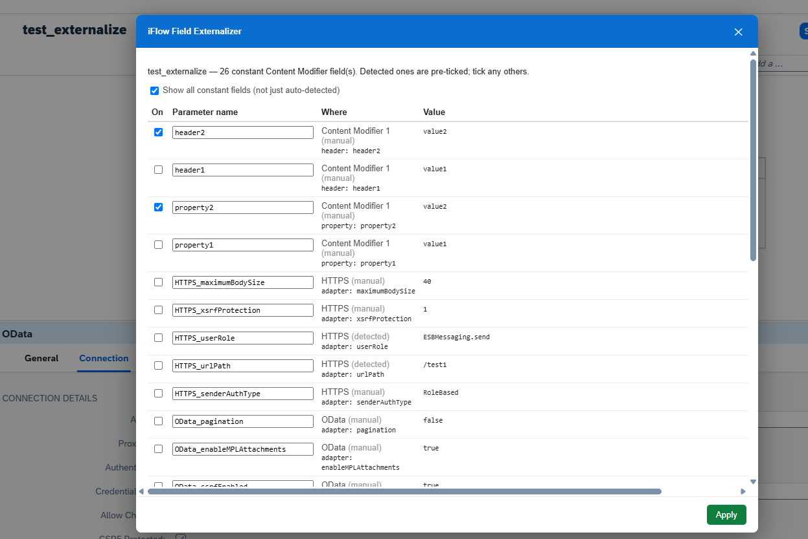
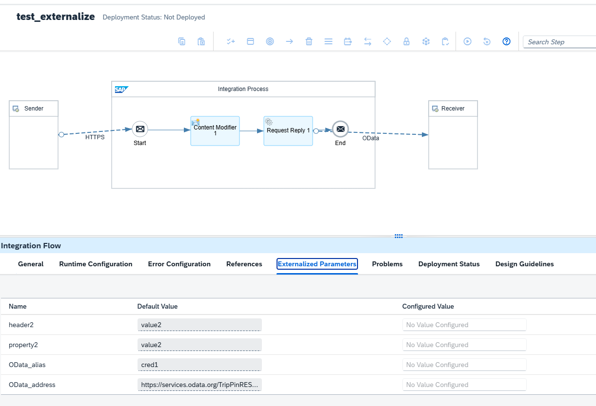

# iFlow Field Externalizer

Externalize hardcoded fields (URLs, hosts, credentials, ports, paths, queues) in **SAP
Integration Suite (Cloud Foundry)** iFlows. Develop with hardcoded values; when the iFlow
reaches a workable state, run the tool once to turn those values into `{{parameters}}` that
appear on the **Configure** screen.

Ships as a **standalone Chrome extension** (bundles the engine + JSZip) that also works as a
**plugin for a compatible CPI browser-helper extension** when one is present. Plus a
dependency-free **Node harness** for offline validation.

It also includes a **Parameter Value Manager** — view/edit externalized-parameter values,
import/export environment profiles (JSON/CSV), and save in place. See
[docs/PARAMETER-VALUE-MANAGER.md](docs/PARAMETER-VALUE-MANAGER.md).

## In action

Open an iFlow, review the hardcoded fields the tool finds (auto-detected ones are pre-ticked;
tick any others), and apply — the parameters land on the **Externalized Parameters** /
Configure screen, ready to set per environment.





## What "externalize" actually does

It is not a UI gesture — it's three edits inside the iFlow project zip:

| File | Change |
|---|---|
| `…/integrationflow/<id>.iflw` | `<value>https://api.acme.com</value>` → `<value>{{Receiver_URL}}</value>` |
| `parameters.prop` | add `Receiver_URL=https://api.acme.com` |
| `parameters.propdef` | add a `<parameter>` definition |

The tool works on the **artifact**, not the graphical canvas.

## Layout

```
manifest.json                         Standalone MV3 extension manifest
popup.html · icons/                   Toolbar popup + extension icons
vendor/jszip.min.js                   Bundled zip lib (for the exported-zip path)
src/engine/engine.js                  Dependency-free core (browser + Node): analyze → apply
src/plugin/field-externalizer.plugin.js   Content script: launcher, review dialog, live save
tools/run-local.mjs                   Node harness (validate against an exported iFlow)
tools/make-icons.mjs · tools/package.mjs  Regenerate icons · build the store zip
test/engine.test.mjs · test/fixtures/     Regression tests + sample iFlow
PUBLISHING.md · PRIVACY.md            Chrome Web Store submission guide + privacy policy
```

## Tests

`npm test` (or `node --test`) runs the regression suite — zero dependencies. It locks the
detection heuristics and the exact `parameters.prop` / `parameters.propdef` byte-format
(fresh-create and merge-into-existing), so a future engine change can't silently break the
output CPI expects.

## Run it as a standalone extension

`manifest.json` is a complete MV3 extension that loads `vendor/jszip.min.js`, then
`src/engine/engine.js`, then the content script (order matters).

1. `chrome://extensions` → Developer mode → **Load unpacked** → this project folder.
2. Open an SAP Integration Suite iFlow in the editor → the **⧉ Externalize fields** launcher
   appears bottom-right (only on iFlow editor pages).

To publish on the Chrome Web Store: `node tools/package.mjs` builds the upload zip; follow
[`PUBLISHING.md`](PUBLISHING.md). Regenerate icons with `node tools/make-icons.mjs`.

## Install as a plugin

The host extension loads plugins as ordinary scripts listed in its manifest. To add this
one:

1. Copy both files into the host extension's `plugins/` folder:
   - `src/engine/engine.js`
   - `src/plugin/field-externalizer.plugin.js`
2. Add them to the host manifest's `content_scripts[].js`, **engine first** (it must load
   before the plugin), e.g.:
   ```json
   "plugins/engine.js",
   "plugins/field-externalizer.plugin.js"
   ```
   The host already bundles `JSZip`, so no extra dependency is needed.
3. Reload the extension. Open an iFlow → click **⧉ Externalize fields** (a floating launcher,
   and an entry in the host's plugin surface).

### How it runs

Two paths in the dialog:

**Live (in place)** — the main path. Externalizes the iFlow open in the editor without
export/import:
1. Reads the editor model via your session:
   `GET {origin}/api/1.0/workspace/{wsHash}/artifacts/{artHash}/entities/{artHash}/iflows/{name}`
   (the workspace/artifact hash ids are resolved automatically from the package/iFlow name).
2. `analyzeModel` finds Content Modifier header/property fields with hardcoded values.
3. You review, tick, and name the parameters.
4. `applyModel` rewrites the model (sets each cell's `Value.key`, adds a
   `listOfExternalizedPropertiesModel` entry) — byte-identical to how CPI externalizes.
5. Downloads a **backup** of the original model, asks for confirmation, then saves:
   `PUT` the model → `DELETE` the draft → **reloads the editor**. Same artifact, no import.

> Save any other pending edits first — the live path reads the last saved model, and the
> reload discards unsaved in-editor changes.

**Exported zip** — offline path: load an exported `.iflw` zip, review, download the
externalized zip (operates on the raw `.iflw` + `parameters.prop`/`.propdef`).

Scope today: **Content Modifier** headers/properties and **adapter/channel** scalar fields
(address, location ID, credential name, proxy, etc.) — both appear in the same review dialog
with the "show all" toggle. Other step types can be added by mapping their model location.

## Offline validation (no browser, no tenant)

1. In CPI: open the iFlow → `…` → **Export**, then unzip to a folder.
2. `node tools/run-local.mjs ./MyIflow --dry` — preview candidates.
3. `node tools/run-local.mjs ./MyIflow ./MyIflow.externalized` — write the result.

`--min=high` externalizes only high-confidence hits (URLs, credentials, addresses); default
`--min=medium` also includes ports, paths, hostnames, queues.

## Detection rules

Externalized: values matching `://` (URLs), credential/alias/user keys, host/address keys,
path/directory keys, port/timeout/pagesize keys, queue/topic keys, and raw hostname/IP
values. **Skipped:** already-`{{externalized}}`, runtime expressions (`${…}`), booleans, and
structural keys (`componentVersion`, `MessageProtocol`, …). All heuristics live in
`classify()` in `src/engine/engine.js`.

## Parameter file formats

Pinned to real CPI (Integration Suite, CF) output and verified against a manually-externalized
iFlow — both when creating the files fresh and when merging into an iFlow that already has
parameters:

- `parameters.prop` — Java Properties format with a `#<timestamp>` header and Java value
  escaping (a URL's colons are written `\:`).
- `parameters.propdef` — `<parameter>` elements directly under `<parameters>` (no
  `<externalized_parameters>` wrapper), `<param_references/>` last, fields
  `key/name/type/isRequired/constraint/description/additionalMetadata`.

Note: CPI sometimes also writes a `property.<Name>` twin entry when a value is externalized
inside a Content Modifier property; that's a CPI-side artifact it regenerates on save — this
tool writes one clean entry per parameter. Booleans/enums (`true`/`false`) are skipped by
design as they're usually structural, not environment config.

## Safety & confidentiality

- Runs entirely within your tenant origin / browser session. **No data goes anywhere else**
  — no external calls, no analytics.
- The live path **saves the draft** (`PUT`) and never deploys. Before writing it downloads a
  JSON **backup** of the original model and asks for explicit confirmation.
- **Test on a throwaway iFlow first.** The write path is tenant-version-specific; validate on
  a disposable copy before running it on real flows.
- Exported zips / model backups contain real endpoints and credential aliases — keep them out
  of shared/synced folders.

## Compatibility note

Also works as a plugin for a popular open-source CPI browser-helper extension: field
externalization is out of that project's scope, so this fills the gap when that extension is
present, reusing its session/UI plumbing via the public plugin contract only — no code from
it is included.

Not affiliated with or endorsed by SAP. "SAP" and "Integration Suite" are trademarks of SAP
SE, used only to describe compatibility.

## License

[MIT](LICENSE) © 2026 quarantineBot. Privacy policy: [`docs/index.html`](docs/index.html)
(hostable on GitHub Pages).
